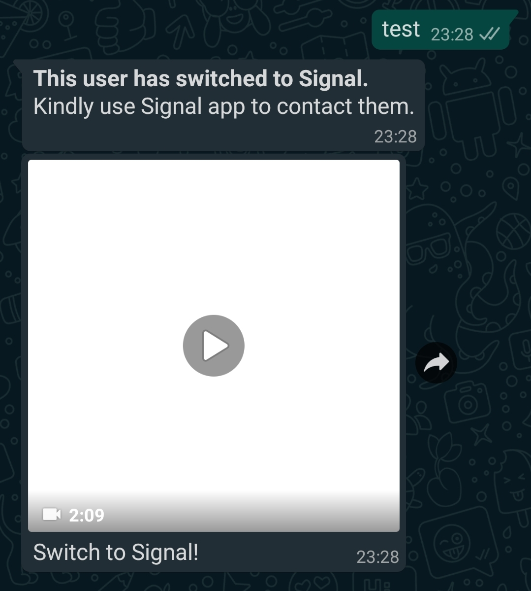

# Whatsapp Signal Notifier

Now whenever someone messages you on Whatsapp, this program will reply that you have moved to Signal.
It will also send them a video to persuade them to switch to Signal(made by https://www.reddit.com/r/signal/comments/kx4msl/i_transformed_the_pictures_of_ucrazylizards_post/).
To save mobile data, it will only send them the video once. It ignores group messages.

## How to use:
On first run, it generates a qrcode image in the appdata folder which you have to scan using Whatsapp-Web option on your phone and login.
On subsequent runs, it uses the session to login.

Made using https://github.com/Rhymen/go-whatsapp. 

## Screenshot:

### Note:
Errors may occur from time to time as I'm still new to this. I gladly welcome pull requests to this.
